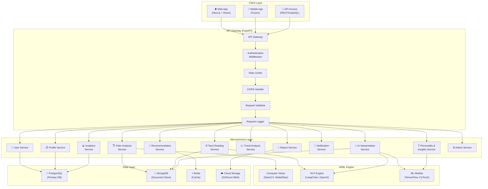
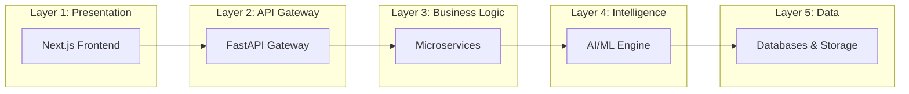
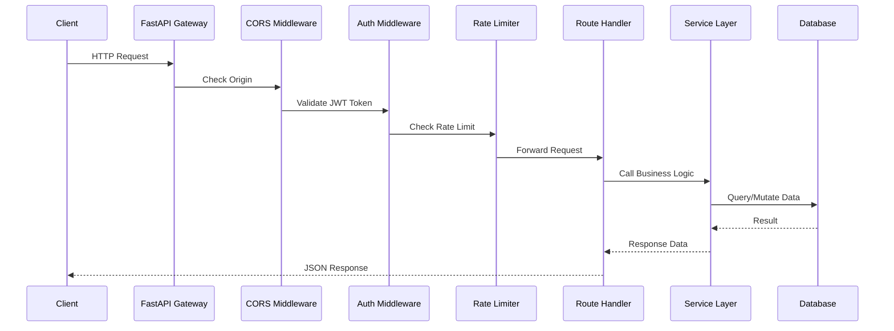
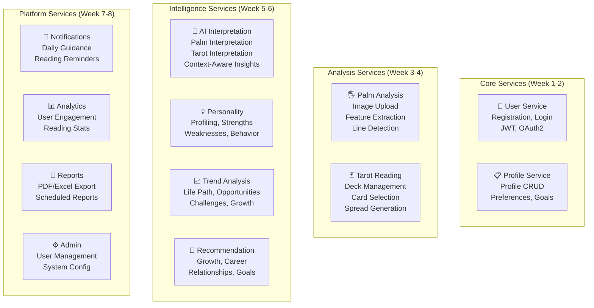
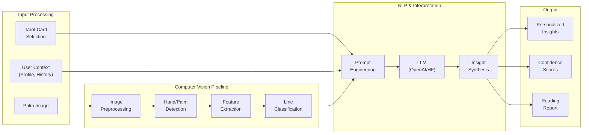
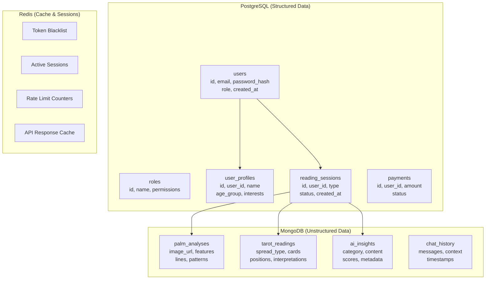
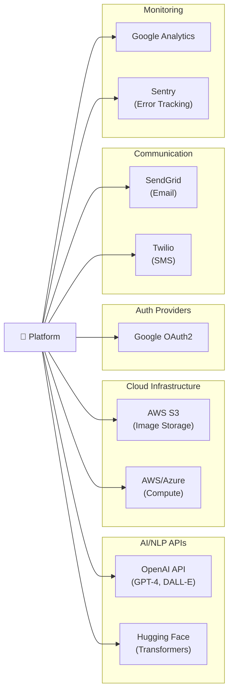
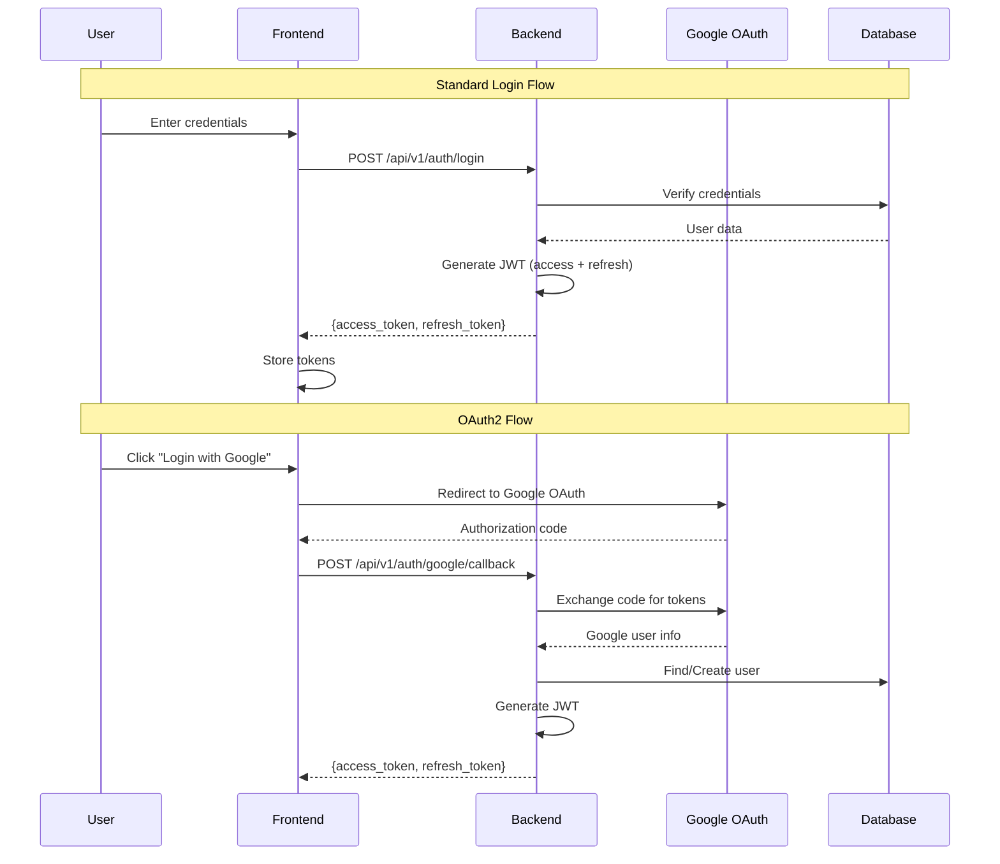
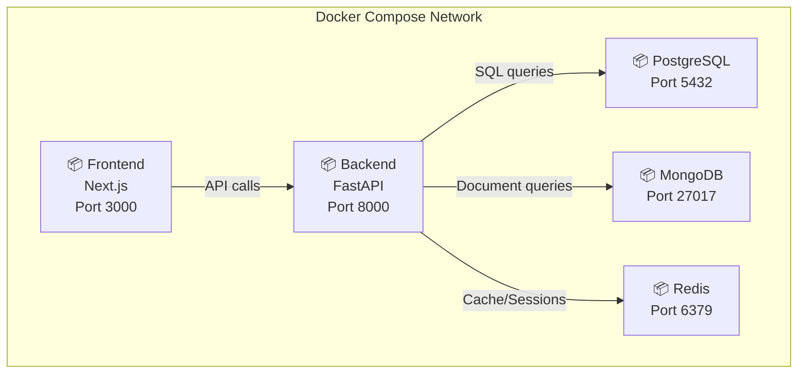
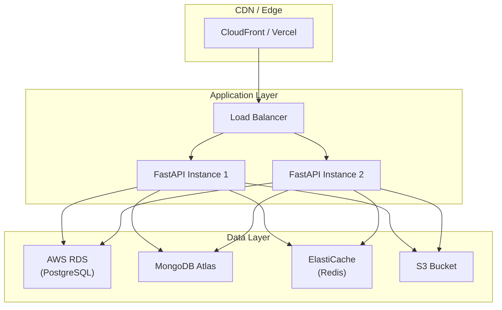

# 🏗️ System Architecture — Palmistry & Tarot Intelligence Platform

## Table of Contents
1. [Architecture Overview](#1-architecture-overview)
2. [System Layers](#2-system-layers)
3. [API Gateway Layer](#3-api-gateway-layer)
4. [Microservices Layer](#4-microservices-layer)
5. [AI/ML & Intelligence Engine](#5-aiml--intelligence-engine)
6. [Data Layer](#6-data-layer)
7. [External Services](#7-external-services)
8. [Security Architecture](#8-security-architecture)
9. [Deployment Architecture](#9-deployment-architecture)
10. [Design Decisions & Trade-offs](#10-design-decisions--trade-offs)

---

## 1. Architecture Overview

The Palmistry & Tarot Intelligence Platform follows a **layered microservices architecture** with a clear separation of concerns. The platform is designed to be modular, scalable, and maintainable.

### High-Level Architecture Diagram



### Design Philosophy

| Principle | Description |
|-----------|-------------|
| **Separation of Concerns** | Each service handles one domain (auth, palm, tarot, etc.) |
| **Async-First** | FastAPI's async capabilities for non-blocking I/O |
| **Database per Concern** | PostgreSQL for structured data, MongoDB for unstructured AI data |
| **Stateless Services** | JWT-based auth, no server-side sessions |
| **API-First** | Backend exposes clean REST APIs, frontend consumes them |

---

## 2. System Layers

The platform is organized into 5 distinct layers:



### Layer Responsibilities

#### Layer 1: Presentation (Frontend)
- **Technology**: Next.js 14 with App Router, React 18, TailwindCSS
- **Role**: User interface rendering, client-side routing, form validation
- **Communication**: REST API calls to backend via Axios
- **State Management**: React Context API + custom hooks

#### Layer 2: API Gateway
- **Technology**: FastAPI (Python)
- **Role**: Request routing, authentication, rate limiting, CORS, logging
- **Key Features**: Automatic OpenAPI docs, async request handling, middleware pipeline

#### Layer 3: Business Logic (Services)
- **Role**: Domain-specific logic (auth, profiles, readings, etc.)
- **Pattern**: Service layer pattern — routers delegate to services, services interact with models
- **Communication**: Direct function calls (monolith-first, microservice-ready)

#### Layer 4: Intelligence Engine
- **Technology**: OpenCV, MediaPipe, TensorFlow, LangChain, OpenAI API
- **Role**: Palm image analysis, tarot card interpretation, AI insight generation
- **Note**: Implemented in Weeks 3-6; placeholder interfaces defined in Week 1

#### Layer 5: Data Layer
- **PostgreSQL**: Users, roles, profiles, sessions, reading metadata
- **MongoDB**: Palm analysis results, tarot reading data, AI-generated insights
- **Redis**: JWT token blacklist, session cache, rate limiting counters
- **Cloud Storage**: Uploaded palm images, generated reports

---

## 3. API Gateway Layer

### Request Flow



### Gateway Configuration

| Feature | Implementation |
|---------|---------------|
| **Routing** | FastAPI APIRouter with versioned prefixes (`/api/v1/`) |
| **Authentication** | JWT Bearer token validation via middleware |
| **Rate Limiting** | Redis-backed sliding window (100 req/min default) |
| **CORS** | Configurable origins, methods, headers |
| **Request Validation** | Pydantic models for automatic validation |
| **Error Handling** | Structured JSON error responses with error codes |
| **API Documentation** | Auto-generated Swagger UI at `/docs` |
| **Health Check** | `/health` endpoint for monitoring |

---

## 4. Microservices Layer

### Service Catalog



### Service Communication Pattern

For Week 1, all services run as modules within a single FastAPI application (monolith-first approach). This simplifies development and debugging. The code is structured to allow extraction into separate microservices later if needed.

```python
# Example: How services are organized
# app/routers/auth.py → calls → app/services/auth_service.py → uses → app/models/user.py
```

---

## 5. AI/ML & Intelligence Engine

> **Note**: The AI/ML engine is implemented in Weeks 3-6. Week 1 defines the interfaces and placeholder services.

### AI Pipeline Architecture



### Technology Choices

| Component | Technology | Why? |
|-----------|-----------|------|
| **Hand Detection** | MediaPipe Hands | Real-time, 21 landmarks, cross-platform |
| **Palm Line Detection** | OpenCV + Custom CNN | Canny edge detection + trained classifier |
| **Image Preprocessing** | Pillow + Albumentations | Robust augmentation pipeline |
| **Card Recognition** | YOLO v8 | Fast object detection for tarot cards |
| **Text Interpretation** | LangChain + OpenAI GPT | Context-aware, structured output |
| **Embeddings** | Sentence Transformers | Semantic similarity for personalization |
| **Model Training** | TensorFlow / PyTorch | Industry-standard deep learning |

---

## 6. Data Layer

### Database Strategy



### Why Two Databases?

| Aspect | PostgreSQL | MongoDB |
|--------|-----------|---------|
| **Use Case** | Users, roles, relationships, transactions | AI outputs, flexible schemas, nested data |
| **Schema** | Fixed, relational, normalized | Flexible, document-oriented |
| **Queries** | Complex JOINs, aggregations | Nested document queries |
| **ACID** | Full ACID compliance | Document-level atomicity |
| **Scaling** | Vertical (read replicas) | Horizontal (sharding) |

---

## 7. External Services

### Integration Points



---

## 8. Security Architecture

### Authentication Flow



### Security Measures

| Measure | Implementation |
|---------|---------------|
| **Password Hashing** | bcrypt with auto-generated salt |
| **JWT Tokens** | RS256 signing, 15min access, 7d refresh |
| **Token Refresh** | Silent refresh via httpOnly cookie |
| **Token Blacklist** | Redis-backed blacklist for revoked tokens |
| **RBAC** | Decorator-based role checking on routes |
| **Input Validation** | Pydantic models on all endpoints |
| **SQL Injection** | SQLAlchemy ORM (parameterized queries) |
| **XSS Protection** | React's default escaping + CSP headers |
| **CORS** | Whitelist-based origin checking |
| **Rate Limiting** | Redis sliding window per IP/user |

### Role-Based Access Control Matrix

| Resource | User | Tarot Reader | Spiritual Consultant | Admin |
|----------|------|-------------|---------------------|-------|
| Own Profile | ✅ CRUD | ✅ CRUD | ✅ CRUD | ✅ CRUD |
| Own Readings | ✅ Read | ✅ Read | ✅ Read | ✅ Read |
| Create Reading | ✅ | ✅ | ✅ | ✅ |
| View Other Users | ❌ | ✅ (clients) | ✅ (clients) | ✅ (all) |
| Reading Analytics | ❌ | ✅ (own) | ✅ (all) | ✅ (all) |
| User Management | ❌ | ❌ | ❌ | ✅ |
| System Config | ❌ | ❌ | ❌ | ✅ |
| Reports Export | ✅ (own) | ✅ (clients) | ✅ (all) | ✅ (all) |

---

## 9. Deployment Architecture

### Development Environment (Docker Compose)



### Production Environment (Week 7-8)



---

## 10. Design Decisions & Trade-offs

### Decision Log

| Decision | Choice | Alternatives Considered | Rationale |
|----------|--------|------------------------|-----------|
| **Backend Framework** | FastAPI | Django, Flask, Express | Async support, auto docs, type hints, performance |
| **Frontend Framework** | Next.js | Create React App, Vite | SSR/SSG, file-based routing, API routes, SEO |
| **Primary DB** | PostgreSQL | MySQL, SQLite | ACID compliance, JSON support, extensions |
| **Document Store** | MongoDB | DynamoDB, Firestore | Flexible schema, rich queries, aggregation pipeline |
| **Cache** | Redis | Memcached | Data structures, pub/sub, persistence options |
| **Auth Strategy** | JWT | Session-based | Stateless, scalable, mobile-friendly |
| **CSS Framework** | TailwindCSS | Styled Components, CSS Modules | Rapid development, consistent design, utility-first |
| **Containerization** | Docker | Vagrant, bare metal | Reproducible environments, easy deployment |
| **Monolith-First** | Single FastAPI app | Separate microservices | Simpler development, easier debugging, extract later |
| **ORM** | SQLAlchemy | Tortoise ORM, Prisma | Mature ecosystem, migration support, community |

### Scalability Considerations

1. **Horizontal Scaling**: Stateless backend allows multiple instances behind a load balancer
2. **Database Read Replicas**: PostgreSQL replicas for read-heavy analytics queries
3. **Caching Strategy**: Redis caching for frequently accessed data (user profiles, reading results)
4. **Async Processing**: Background tasks for AI model inference (Celery + Redis as broker)
5. **CDN**: Static assets and generated reports served via CDN
6. **Image Optimization**: Uploaded palm images resized and compressed before storage

---

## Appendix: File Organization Convention

```
backend/
├── app/
│   ├── main.py          # App factory, middleware registration
│   ├── config.py        # Pydantic Settings (env-based config)
│   ├── database.py      # DB connection factories
│   ├── models/          # SQLAlchemy ORM models (DB tables)
│   ├── schemas/         # Pydantic schemas (API contracts)
│   ├── routers/         # FastAPI route handlers (thin layer)
│   ├── services/        # Business logic (thick layer)
│   ├── middleware/       # Custom middleware (auth, logging)
│   └── utils/           # Shared utilities (security, helpers)
```

**Naming Convention**:
- Models: `PascalCase` (e.g., `User`, `UserProfile`)
- Tables: `snake_case` (e.g., `users`, `user_profiles`)
- Endpoints: `kebab-case` (e.g., `/api/v1/auth/login`)
- Files: `snake_case` (e.g., `auth_service.py`)
