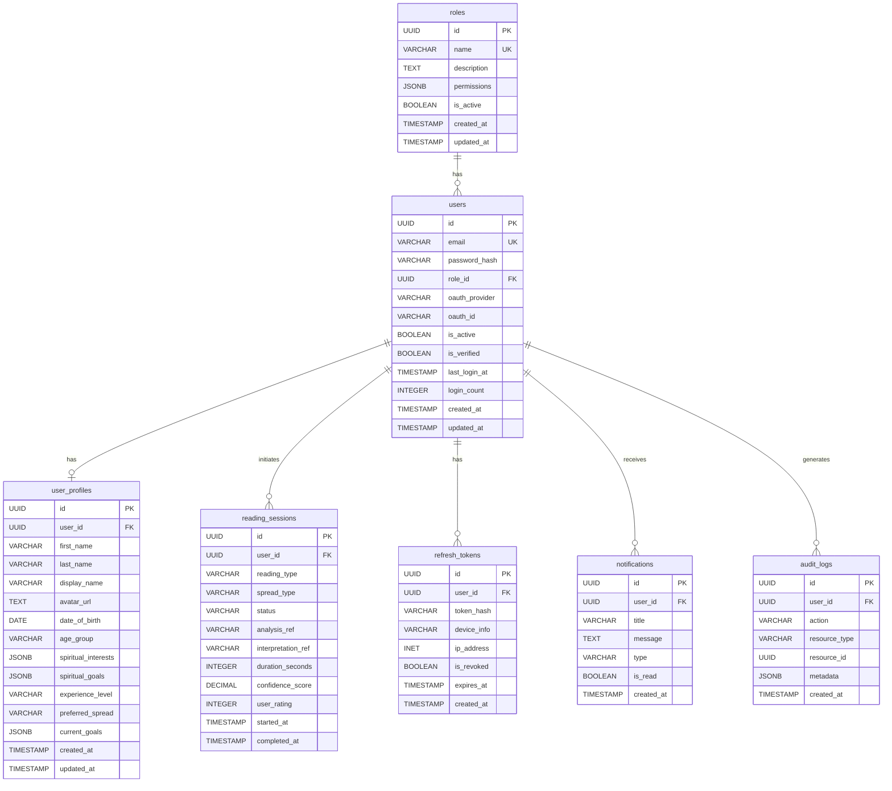

# 🗄️ Database Schema — Palmistry & Tarot Intelligence Platform

## Table of Contents
1. [Database Strategy](#1-database-strategy)
2. [PostgreSQL Schema (Relational Data)](#2-postgresql-schema)
3. [MongoDB Schema (Document Data)](#3-mongodb-schema)
4. [Redis Data Structures](#4-redis-data-structures)
5. [Entity Relationship Diagram](#5-entity-relationship-diagram)
6. [Migration Strategy](#6-migration-strategy)
7. [Indexing Strategy](#7-indexing-strategy)

---

## 1. Database Strategy

### Multi-Database Architecture

| Database | Purpose | Data Type |
|----------|---------|-----------|
| **PostgreSQL** | Primary relational store | Users, roles, profiles, sessions, payments |
| **MongoDB** | Document store for AI data | Palm analyses, tarot readings, AI insights |
| **Redis** | Cache & real-time data | Sessions, tokens, rate limits, temp data |

### Design Principles

1. **Normalize** relational data in PostgreSQL (3NF)
2. **Denormalize** document data in MongoDB for read performance
3. **Cache** frequently accessed data in Redis (TTL-based)
4. **Reference** between PostgreSQL and MongoDB via `user_id` and `reading_session_id`

---

## 2. PostgreSQL Schema

### 2.1 `roles` Table

Stores the 4 system roles.

```sql
CREATE TABLE roles (
    id              UUID PRIMARY KEY DEFAULT gen_random_uuid(),
    name            VARCHAR(50) UNIQUE NOT NULL,    -- 'user', 'tarot_reader', 'spiritual_consultant', 'admin'
    description     TEXT,
    permissions     JSONB DEFAULT '{}',             -- Flexible permission storage
    is_active       BOOLEAN DEFAULT TRUE,
    created_at      TIMESTAMP WITH TIME ZONE DEFAULT NOW(),
    updated_at      TIMESTAMP WITH TIME ZONE DEFAULT NOW()
);

-- Seed data
INSERT INTO roles (name, description, permissions) VALUES
    ('user', 'Regular user', '{"can_read": true, "can_create_reading": true}'),
    ('tarot_reader', 'Professional tarot reader', '{"can_read": true, "can_create_reading": true, "can_view_clients": true, "can_manage_sessions": true}'),
    ('spiritual_consultant', 'Spiritual consultant', '{"can_read": true, "can_create_reading": true, "can_view_clients": true, "can_view_analytics": true, "can_manage_consultations": true}'),
    ('admin', 'System administrator', '{"all": true}');
```

### 2.2 `users` Table

Core user authentication data.

```sql
CREATE TABLE users (
    id              UUID PRIMARY KEY DEFAULT gen_random_uuid(),
    email           VARCHAR(255) UNIQUE NOT NULL,
    password_hash   VARCHAR(255),                   -- NULL for OAuth-only users
    role_id         UUID NOT NULL REFERENCES roles(id),
    
    -- OAuth fields
    oauth_provider  VARCHAR(50),                    -- 'google', null for email users
    oauth_id        VARCHAR(255),                   -- Provider-specific user ID
    
    -- Account status
    is_active       BOOLEAN DEFAULT TRUE,
    is_verified     BOOLEAN DEFAULT FALSE,
    email_verified_at TIMESTAMP WITH TIME ZONE,
    last_login_at   TIMESTAMP WITH TIME ZONE,
    login_count     INTEGER DEFAULT 0,
    
    -- Timestamps
    created_at      TIMESTAMP WITH TIME ZONE DEFAULT NOW(),
    updated_at      TIMESTAMP WITH TIME ZONE DEFAULT NOW(),
    
    -- Constraints
    CONSTRAINT uq_oauth UNIQUE (oauth_provider, oauth_id)
);

-- Indexes
CREATE INDEX idx_users_email ON users(email);
CREATE INDEX idx_users_role_id ON users(role_id);
CREATE INDEX idx_users_oauth ON users(oauth_provider, oauth_id);
CREATE INDEX idx_users_is_active ON users(is_active);
```

### 2.3 `user_profiles` Table

Extended user information and preferences.

```sql
CREATE TABLE user_profiles (
    id                  UUID PRIMARY KEY DEFAULT gen_random_uuid(),
    user_id             UUID UNIQUE NOT NULL REFERENCES users(id) ON DELETE CASCADE,
    
    -- Personal Information
    first_name          VARCHAR(100),
    last_name           VARCHAR(100),
    display_name        VARCHAR(100),
    avatar_url          TEXT,
    date_of_birth       DATE,
    age_group           VARCHAR(20),                -- '18-25', '26-35', '36-45', '46-55', '55+'
    gender              VARCHAR(20),
    
    -- Location
    country             VARCHAR(100),
    timezone            VARCHAR(50),
    
    -- Spiritual Profile
    spiritual_interests JSONB DEFAULT '[]',         -- ['palmistry', 'tarot', 'astrology', 'numerology']
    spiritual_goals     JSONB DEFAULT '[]',         -- ['self_discovery', 'career_guidance', 'relationships']
    experience_level    VARCHAR(20) DEFAULT 'beginner', -- 'beginner', 'intermediate', 'advanced'
    
    -- Reading Preferences
    preferred_spread    VARCHAR(50),                -- Default tarot spread preference
    preferred_reading_time VARCHAR(20),             -- 'morning', 'afternoon', 'evening', 'night'
    notification_enabled BOOLEAN DEFAULT TRUE,
    
    -- Goals & Tracking
    current_goals       JSONB DEFAULT '[]',         -- Active personal goals
    bio                 TEXT,
    
    -- Timestamps
    created_at          TIMESTAMP WITH TIME ZONE DEFAULT NOW(),
    updated_at          TIMESTAMP WITH TIME ZONE DEFAULT NOW()
);

-- Indexes
CREATE INDEX idx_profiles_user_id ON user_profiles(user_id);
```

### 2.4 `reading_sessions` Table

Tracks every reading (palm or tarot) a user initiates.

```sql
CREATE TABLE reading_sessions (
    id              UUID PRIMARY KEY DEFAULT gen_random_uuid(),
    user_id         UUID NOT NULL REFERENCES users(id) ON DELETE CASCADE,
    
    -- Reading type
    reading_type    VARCHAR(20) NOT NULL,            -- 'palm', 'tarot', 'combined'
    spread_type     VARCHAR(50),                     -- For tarot: 'single', 'three_card', 'celtic_cross', etc.
    
    -- Status tracking
    status          VARCHAR(20) DEFAULT 'initiated', -- 'initiated', 'processing', 'completed', 'failed'
    
    -- References to MongoDB documents
    analysis_ref    VARCHAR(100),                     -- MongoDB ObjectId reference for analysis data
    interpretation_ref VARCHAR(100),                  -- MongoDB ObjectId reference for interpretation
    
    -- Metadata
    duration_seconds INTEGER,                        -- How long the reading took
    confidence_score DECIMAL(5,4),                   -- Overall confidence (0.0000 to 1.0000)
    user_rating     INTEGER CHECK (user_rating BETWEEN 1 AND 5),
    user_feedback   TEXT,
    
    -- Timestamps
    started_at      TIMESTAMP WITH TIME ZONE DEFAULT NOW(),
    completed_at    TIMESTAMP WITH TIME ZONE,
    created_at      TIMESTAMP WITH TIME ZONE DEFAULT NOW()
);

-- Indexes
CREATE INDEX idx_sessions_user_id ON reading_sessions(user_id);
CREATE INDEX idx_sessions_type ON reading_sessions(reading_type);
CREATE INDEX idx_sessions_status ON reading_sessions(status);
CREATE INDEX idx_sessions_created ON reading_sessions(created_at DESC);
```

### 2.5 `refresh_tokens` Table

Stores refresh tokens for JWT auth.

```sql
CREATE TABLE refresh_tokens (
    id              UUID PRIMARY KEY DEFAULT gen_random_uuid(),
    user_id         UUID NOT NULL REFERENCES users(id) ON DELETE CASCADE,
    token_hash      VARCHAR(255) NOT NULL,           -- Hashed refresh token
    device_info     VARCHAR(255),                    -- User agent / device
    ip_address      INET,
    is_revoked      BOOLEAN DEFAULT FALSE,
    expires_at      TIMESTAMP WITH TIME ZONE NOT NULL,
    created_at      TIMESTAMP WITH TIME ZONE DEFAULT NOW()
);

-- Indexes
CREATE INDEX idx_refresh_tokens_user ON refresh_tokens(user_id);
CREATE INDEX idx_refresh_tokens_hash ON refresh_tokens(token_hash);
CREATE INDEX idx_refresh_tokens_expires ON refresh_tokens(expires_at);
```

### 2.6 `notifications` Table

```sql
CREATE TABLE notifications (
    id              UUID PRIMARY KEY DEFAULT gen_random_uuid(),
    user_id         UUID NOT NULL REFERENCES users(id) ON DELETE CASCADE,
    title           VARCHAR(255) NOT NULL,
    message         TEXT NOT NULL,
    type            VARCHAR(50) NOT NULL,            -- 'guidance', 'reminder', 'insight', 'system'
    is_read         BOOLEAN DEFAULT FALSE,
    action_url      TEXT,
    metadata        JSONB DEFAULT '{}',
    created_at      TIMESTAMP WITH TIME ZONE DEFAULT NOW(),
    read_at         TIMESTAMP WITH TIME ZONE
);

-- Indexes
CREATE INDEX idx_notifications_user ON notifications(user_id);
CREATE INDEX idx_notifications_unread ON notifications(user_id, is_read) WHERE NOT is_read;
```

### 2.7 `audit_logs` Table

```sql
CREATE TABLE audit_logs (
    id              UUID PRIMARY KEY DEFAULT gen_random_uuid(),
    user_id         UUID REFERENCES users(id),
    action          VARCHAR(100) NOT NULL,           -- 'user.login', 'reading.created', 'profile.updated'
    resource_type   VARCHAR(50),                     -- 'user', 'reading', 'profile'
    resource_id     UUID,
    ip_address      INET,
    user_agent      TEXT,
    metadata        JSONB DEFAULT '{}',
    created_at      TIMESTAMP WITH TIME ZONE DEFAULT NOW()
);

-- Indexes
CREATE INDEX idx_audit_user ON audit_logs(user_id);
CREATE INDEX idx_audit_action ON audit_logs(action);
CREATE INDEX idx_audit_created ON audit_logs(created_at DESC);
```

---

## 3. MongoDB Schema

### 3.1 `palm_analyses` Collection

Stores raw and processed palm analysis data.

```javascript
{
    "_id": ObjectId("..."),
    "reading_session_id": "uuid-string",    // Links to PostgreSQL reading_sessions.id
    "user_id": "uuid-string",               // Links to PostgreSQL users.id
    
    // Image Data
    "image": {
        "original_url": "https://s3.../palm_original_123.jpg",
        "processed_url": "https://s3.../palm_processed_123.jpg",
        "thumbnail_url": "https://s3.../palm_thumb_123.jpg",
        "dimensions": { "width": 1920, "height": 1080 },
        "file_size_bytes": 245000,
        "format": "jpeg"
    },
    
    // Hand Detection
    "hand_detection": {
        "hand_detected": true,
        "hand_side": "right",               // 'left' or 'right'
        "confidence": 0.95,
        "landmarks": [                       // MediaPipe 21 hand landmarks
            { "id": 0, "x": 0.52, "y": 0.71, "z": -0.01 },
            // ... 20 more landmarks
        ],
        "bounding_box": { "x": 100, "y": 50, "width": 400, "height": 600 }
    },
    
    // Palm Lines Detected
    "palm_lines": {
        "life_line": {
            "detected": true,
            "confidence": 0.89,
            "length": "long",               // 'short', 'medium', 'long'
            "depth": "deep",                 // 'faint', 'medium', 'deep'
            "curvature": "curved",           // 'straight', 'curved', 'broken'
            "breaks": 0,
            "branches": 2,
            "points": [                      // Line coordinate points
                { "x": 150, "y": 200 },
                { "x": 160, "y": 220 },
                // ... more points
            ]
        },
        "head_line": {
            "detected": true,
            "confidence": 0.87,
            "length": "medium",
            "depth": "medium",
            "curvature": "slightly_curved",
            "breaks": 0,
            "branches": 1,
            "points": []
        },
        "heart_line": {
            "detected": true,
            "confidence": 0.91,
            "length": "long",
            "depth": "deep",
            "curvature": "curved",
            "breaks": 0,
            "branches": 3,
            "points": []
        },
        "fate_line": {
            "detected": true,
            "confidence": 0.72,
            "length": "medium",
            "depth": "faint",
            "curvature": "straight",
            "breaks": 1,
            "branches": 0,
            "points": []
        },
        "sun_line": {
            "detected": false,
            "confidence": 0.0
        }
    },
    
    // Palm Shape Analysis
    "palm_shape": {
        "shape_type": "square",              // 'square', 'rectangular', 'conical', 'spatulate'
        "element": "earth",                  // 'earth', 'air', 'water', 'fire'
        "confidence": 0.83
    },
    
    // Finger Analysis
    "finger_analysis": {
        "finger_lengths": {
            "thumb": "normal",
            "index": "long",
            "middle": "normal",
            "ring": "short",
            "pinky": "normal"
        },
        "finger_spacing": "wide",            // 'close', 'normal', 'wide'
        "dominant_finger": "index"
    },
    
    // Processing Metadata
    "processing": {
        "model_version": "palm-v1.0",
        "processing_time_ms": 2340,
        "opencv_version": "4.9.0",
        "mediapipe_version": "0.10.9"
    },
    
    "created_at": ISODate("2025-01-15T10:30:00Z"),
    "updated_at": ISODate("2025-01-15T10:30:02Z")
}
```

### 3.2 `tarot_readings` Collection

Stores tarot card selections and spread data.

```javascript
{
    "_id": ObjectId("..."),
    "reading_session_id": "uuid-string",
    "user_id": "uuid-string",
    
    // Spread Configuration
    "spread": {
        "type": "three_card",                // 'single', 'three_card', 'celtic_cross', etc.
        "name": "Past, Present, Future",
        "positions": [
            { "index": 0, "label": "Past", "description": "Influences from your past" },
            { "index": 1, "label": "Present", "description": "Current situation" },
            { "index": 2, "label": "Future", "description": "What lies ahead" }
        ]
    },
    
    // Cards Drawn
    "cards": [
        {
            "position_index": 0,
            "card": {
                "id": "major_10",
                "name": "Wheel of Fortune",
                "arcana": "major",           // 'major' or 'minor'
                "suit": null,                // null for major arcana; 'cups', 'wands', 'swords', 'pentacles'
                "number": 10,
                "image_url": "/tarot/major/wheel_of_fortune.jpg",
                "is_reversed": false
            },
            "interpretation": {
                "upright_meaning": "Change, cycles, inevitable fate, luck, destiny, a turning point",
                "reversed_meaning": "Bad luck, resistance to change, breaking cycles",
                "applied_meaning": "upright",
                "keywords": ["change", "destiny", "turning point", "cycles"],
                "element": "fire",
                "zodiac": "Jupiter",
                "position_specific": "Past changes and cycles have brought you to this moment. A significant turning point occurred that set your current path in motion."
            }
        },
        // ... more cards for each position
    ],
    
    // Reading Context
    "context": {
        "user_question": "What should I focus on for career growth?",
        "category": "career",                // 'general', 'love', 'career', 'health', 'spiritual'
        "mood": "curious",
        "shuffle_seed": 847293               // For reproducibility
    },
    
    // Synthesis
    "synthesis": {
        "overall_theme": "Transformation and new beginnings",
        "narrative": "The cards suggest a period of significant change...",
        "action_items": [
            "Embrace upcoming changes rather than resisting them",
            "Trust your intuition when making career decisions",
            "Seek mentorship from experienced professionals"
        ],
        "energy": "positive",                // 'positive', 'neutral', 'challenging', 'transformative'
        "confidence_score": 0.85
    },
    
    "created_at": ISODate("2025-01-15T11:00:00Z")
}
```

### 3.3 `ai_insights` Collection

Stores AI-generated interpretations and insights.

```javascript
{
    "_id": ObjectId("..."),
    "reading_session_id": "uuid-string",
    "user_id": "uuid-string",
    
    // Source References
    "sources": {
        "palm_analysis_id": ObjectId("..."),
        "tarot_reading_id": ObjectId("..."),
    },
    
    // Insight Categories
    "insights": {
        "personality": {
            "traits": ["analytical", "creative", "empathetic"],
            "dominant_element": "water",
            "personality_type": "The Intuitive Creator",
            "description": "You possess a unique blend of analytical thinking and creative expression...",
            "confidence": 0.82
        },
        "relationships": {
            "style": "deep_connector",
            "strengths": ["empathy", "loyalty", "communication"],
            "challenges": ["boundaries", "over-giving"],
            "guidance": "Focus on setting healthy boundaries while maintaining your natural empathy...",
            "confidence": 0.78
        },
        "career": {
            "strengths": ["creativity", "problem_solving", "leadership"],
            "ideal_fields": ["creative arts", "counseling", "technology"],
            "current_phase": "growth",
            "guidance": "Your analytical mind combined with creativity positions you well for...",
            "confidence": 0.80
        },
        "health_wellness": {
            "focus_areas": ["stress_management", "emotional_balance"],
            "recommendations": ["meditation", "creative expression", "nature walks"],
            "confidence": 0.70
        },
        "personal_growth": {
            "current_stage": "self_discovery",
            "opportunities": ["develop intuition", "embrace change", "build confidence"],
            "challenges": ["self-doubt", "perfectionism"],
            "action_plan": [
                "Start a daily journaling practice",
                "Explore creative outlets",
                "Practice mindfulness meditation"
            ],
            "confidence": 0.85
        }
    },
    
    // Scoring
    "scores": {
        "palm_analysis_confidence": 0.87,    // 30% weight
        "tarot_interpretation_relevance": 0.82, // 25% weight
        "personality_alignment": 0.79,        // 20% weight
        "user_context_relevance": 0.91,       // 15% weight
        "reading_consistency": 0.84,          // 10% weight
        "overall_insight_score": 0.85         // Weighted average
    },
    
    // AI Metadata
    "ai_metadata": {
        "model": "gpt-4",
        "prompt_version": "v1.2",
        "tokens_used": 1250,
        "generation_time_ms": 3400
    },
    
    "created_at": ISODate("2025-01-15T11:05:00Z")
}
```

### 3.4 `tarot_deck` Collection (Reference Data)

Stores the complete tarot deck metadata.

```javascript
{
    "_id": ObjectId("..."),
    "card_id": "major_00",
    "name": "The Fool",
    "arcana": "major",
    "suit": null,
    "number": 0,
    "image_url": "/tarot/major/the_fool.jpg",
    
    "meanings": {
        "upright": {
            "keywords": ["new beginnings", "innocence", "spontaneity", "free spirit"],
            "description": "The Fool represents new beginnings, having faith in the future...",
            "love": "A new relationship or fresh start in love...",
            "career": "A new job, career change, or exciting opportunity...",
            "finance": "Taking a financial risk that could pay off...",
            "health": "A fresh approach to health and wellness..."
        },
        "reversed": {
            "keywords": ["recklessness", "risk-taking", "foolishness"],
            "description": "The reversed Fool warns against reckless behavior...",
            "love": "Being naive about a relationship...",
            "career": "Making impulsive career decisions...",
            "finance": "Risky investments without proper research...",
            "health": "Ignoring health warnings..."
        }
    },
    
    "symbolism": {
        "element": "air",
        "zodiac": "Uranus",
        "numerology": 0,
        "colors": ["yellow", "white", "blue"],
        "symbols": ["cliff", "dog", "bundle", "white rose"]
    },
    
    "is_active": true,
    "created_at": ISODate("2025-01-01T00:00:00Z")
}
```

---

## 4. Redis Data Structures

### 4.1 Token Blacklist

```
# Revoked JWT tokens (SET with TTL)
Key: blacklist:{jwt_token_id}
Value: 1
TTL: Same as token expiry
```

### 4.2 Active Sessions

```
# User session tracking (HASH)
Key: session:{user_id}
Fields:
    - last_active: "2025-01-15T10:30:00Z"
    - device: "Chrome/Windows"
    - ip: "192.168.1.1"
TTL: 30 minutes (sliding)
```

### 4.3 Rate Limiting

```
# API rate limiting (SORTED SET)
Key: ratelimit:{ip_address}:{endpoint}
Members: timestamp of each request
Score: timestamp
TTL: 1 minute (window)
```

### 4.4 Reading Cache

```
# Cached reading results (STRING with JSON)
Key: reading:{reading_session_id}
Value: JSON serialized reading result
TTL: 1 hour
```

---

## 5. Entity Relationship Diagram



---

## 6. Migration Strategy

### Using Alembic

Alembic is the database migration tool for SQLAlchemy. It tracks schema changes and applies them in order.

```bash
# Initialize Alembic (one-time)
alembic init alembic

# Create a new migration
alembic revision --autogenerate -m "create_users_table"

# Apply all migrations
alembic upgrade head

# Rollback one migration
alembic downgrade -1

# View migration history
alembic history
```

### Migration Naming Convention

```
versions/
├── 001_create_roles_table.py
├── 002_create_users_table.py
├── 003_create_user_profiles_table.py
├── 004_create_reading_sessions_table.py
├── 005_create_refresh_tokens_table.py
├── 006_create_notifications_table.py
└── 007_create_audit_logs_table.py
```

### MongoDB Migrations

MongoDB doesn't require schema migrations (schemaless), but we use validation rules:

```javascript
// Apply validation rules to collections
db.createCollection("palm_analyses", {
    validator: {
        $jsonSchema: {
            bsonType: "object",
            required: ["reading_session_id", "user_id", "created_at"],
            properties: {
                reading_session_id: { bsonType: "string" },
                user_id: { bsonType: "string" },
                hand_detection: { bsonType: "object" },
                palm_lines: { bsonType: "object" }
            }
        }
    }
});
```

---

## 7. Indexing Strategy

### PostgreSQL Indexes

| Table | Index | Type | Rationale |
|-------|-------|------|-----------|
| `users` | `email` | B-tree UNIQUE | Login lookups |
| `users` | `(oauth_provider, oauth_id)` | B-tree COMPOSITE | OAuth login |
| `users` | `role_id` | B-tree | Role-based queries |
| `user_profiles` | `user_id` | B-tree UNIQUE | Profile lookups |
| `reading_sessions` | `user_id` | B-tree | User's reading history |
| `reading_sessions` | `created_at DESC` | B-tree | Recent readings |
| `reading_sessions` | `(reading_type, status)` | B-tree COMPOSITE | Filtered queries |
| `refresh_tokens` | `token_hash` | B-tree | Token validation |
| `notifications` | `(user_id, is_read)` | Partial (WHERE NOT is_read) | Unread notifications |

### MongoDB Indexes

```javascript
// palm_analyses
db.palm_analyses.createIndex({ "user_id": 1 });
db.palm_analyses.createIndex({ "reading_session_id": 1 }, { unique: true });
db.palm_analyses.createIndex({ "created_at": -1 });

// tarot_readings
db.tarot_readings.createIndex({ "user_id": 1 });
db.tarot_readings.createIndex({ "reading_session_id": 1 }, { unique: true });
db.tarot_readings.createIndex({ "spread.type": 1 });

// ai_insights
db.ai_insights.createIndex({ "user_id": 1 });
db.ai_insights.createIndex({ "reading_session_id": 1 }, { unique: true });

// tarot_deck (reference data)
db.tarot_deck.createIndex({ "card_id": 1 }, { unique: true });
db.tarot_deck.createIndex({ "arcana": 1, "suit": 1 });
```

### Performance Considerations

1. **UUID vs SERIAL**: We use UUIDs for distributed compatibility and security (non-guessable IDs)
2. **JSONB columns**: Use GIN indexes for JSONB queries if needed
3. **Partial indexes**: Notifications table uses partial index for unread-only queries
4. **TTL in Redis**: All cached data has explicit TTL to prevent memory overflow
5. **Connection pooling**: Use PgBouncer or SQLAlchemy's built-in pool for PostgreSQL
