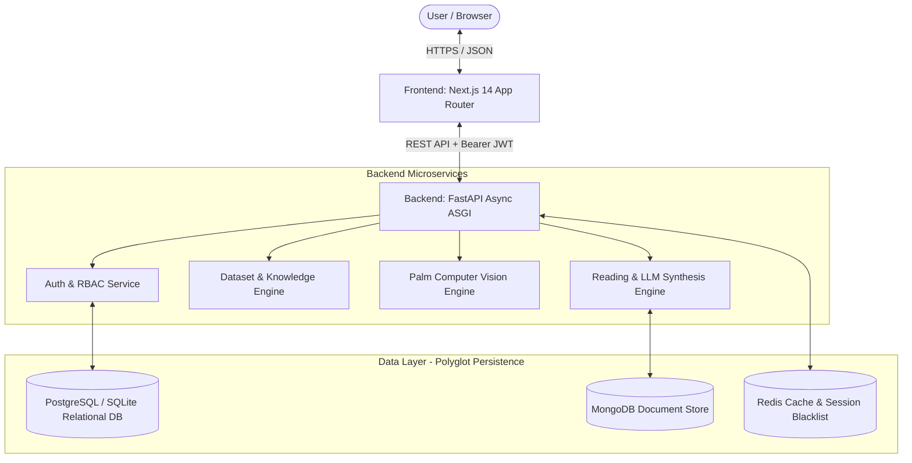
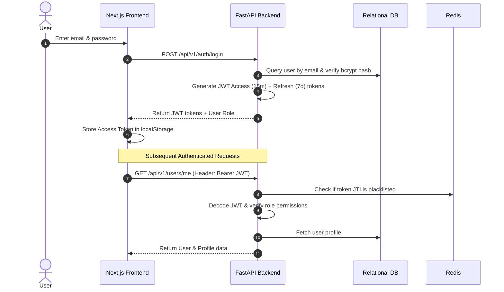
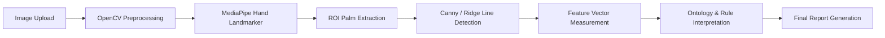

# 🎓 Faculty Presentation & Viva Defense Guide
## Palmistry & Tarot Intelligence Platform (MysticAI)

> **Document Purpose:** This guide is written for you to understand, explain, and defend the entire project to your faculty, professors, and external examiners with full technical confidence—even if you had zero prior knowledge of Tarot or Palmistry.

---

## 📌 Table of Contents
1. [30-Second Elevator Pitch (What to Say First)](#1-30-second-elevator-pitch)
2. [Demystifying the Domain in Computer Science Terms](#2-demystifying-the-domain-in-computer-science-terms)
   - [What is Tarot in CS Terms?](#what-is-tarot-in-cs-terms)
   - [What is Palmistry in CS Terms?](#what-is-palmistry-in-cs-terms)
3. [System Architecture & Tech Stack](#3-system-architecture--tech-stack)
4. [Step-by-Step System Workflows](#4-step-by-step-system-workflows)
   - [Workflow A: User Authentication & Role-Based Access (RBAC)](#workflow-a-user-authentication--role-based-access-rbac)
   - [Workflow B: Tarot Reading Pipeline](#workflow-b-tarot-reading-pipeline)
   - [Workflow C: Palmistry Computer Vision Pipeline](#workflow-c-palmistry-computer-vision-pipeline)
5. [Database Design & Polyglot Persistence](#5-database-design--polyglot-persistence)
6. [Live Website Demo Script (How to Showcase Screen-by-Screen)](#6-live-website-demo-script)
7. [Completed Features vs. Future Development Roadmap](#7-completed-features-vs-future-development-roadmap)
8. [Directory Structure & Code Organization](#8-directory-structure--code-organization)
9. [Faculty Viva / Presentation Q&A Cheatsheet](#9-faculty-viva--presentation-qa-cheatsheet)

---

## 1. 30-Second Elevator Pitch

> *"Our project, the **Palmistry & Tarot Intelligence Platform**, is a full-stack, AI-powered multimodal platform. It combines **Computer Vision** for palm morphology extraction and **Knowledge Graph / NLP models** for Tarot interpretation to provide automated, personalized, and structured self-reflection readings. The system is built using a modern **FastAPI** backend, a responsive **Next.js** frontend, a **Polyglot Database Architecture** (SQL for user & auth management, NoSQL for high-dimensional reading payloads), and strict **Role-Based Access Control (RBAC)**."*

---

## 2. Demystifying the Domain in Computer Science Terms

Professors evaluate the **computer science and software engineering depth**, not spirituality. Explain the domain as structured data and image processing:

### What is Tarot in CS Terms?
* **A Structured Reference Knowledge Base:**
  * Tarot is essentially a **finite dataset of 78 discrete semantic nodes** (cards).
  * **22 Major Arcana:** Universal life archetypes (e.g., The Fool = New Beginnings, The Magician = Resourcefulness).
  * **56 Minor Arcana:** Categorized into 4 domains/suits:
    * *Wands* $\to$ Energy, ambition, creativity
    * *Cups* $\to$ Emotions, relationships
    * *Swords* $\to$ Intellect, decision-making, conflict
    * *Pentacles* $\to$ Career, material resources, finances
* **Polarity (Binary State):** Each card has two states: `Upright` (positive/direct expression) and `Reversed` (internalized/blocked expression).
* **Graph Spreads:** A reading arranges drawn cards into a multi-node positional graph:
  * **3-Card Spread:** Node 1 = Past Context, Node 2 = Present Situation, Node 3 = Future Outcome.
  * **Celtic Cross (10 Cards):** Positional context matrix (Core issue, Obstacle, Subconscious, Past, Hopes/Fears, Final Advice).

---

### What is Palmistry in CS Terms?
* **A 2D/3D Geometric Computer Vision Problem:**
  * Palmistry is the algorithmic extraction and analysis of **hand morphological features and crease lines**.
* **Key Visual Features Extracted:**
  * **Hand Landmarks:** 21 anatomical landmark coordinates (wrist, knuckles, fingertips) extracted using Google MediaPipe Hand Landmarker.
  * **Regions of Interest (ROI):** Dynamic bounding boxes isolating the palm plane.
  * **Major Palm Lines (Edge & Ridge Detection):**
    1. *Heart Line* (Upper palm horizontal line) $\to$ Emotional expression & stress markers.
    2. *Head Line* (Middle palm transversal line) $\to$ Cognitive style (analytical vs. creative).
    3. *Life Line* (Thumb radial arc) $\to$ Energy levels, vitality, life transitions.
    4. *Fate Line* (Vertical central line) $\to$ Career direction and focus.
* **Interpretation Engine:** Mathematical feature extraction (length, curvature, depth, continuity/breaks) mapped against an ontological rule engine or LLM prompt synthesis.

---

## 3. System Architecture & Tech Stack



### Technology Breakdown

| Layer | Technology | Why Chosen? |
| :--- | :--- | :--- |
| **Frontend** | **Next.js 14 (React), TailwindCSS** | Server-Side Rendering (SSR) + Client components, rapid page loads, responsive dark glassmorphism design. |
| **Backend** | **FastAPI (Python 3.11)** | Asynchronous non-blocking I/O, automatic Pydantic request validation, high throughput, auto-generated OpenAPI/Swagger documentation. |
| **Relational DB** | **PostgreSQL (or SQLite fallback)** | ACID compliance for transactional data: User credentials, JWT auth, RBAC roles, user profiles. |
| **Document DB** | **MongoDB** | Schema-free JSON documents for complex AI outputs (MediaPipe 21-point coordinates, raw LLM token streams, dynamic spreads). |
| **Cache & In-Memory** | **Redis** | Sub-millisecond JWT blacklist checks, session rate limiting, and frequent query caching. |

---

## 4. Step-by-Step System Workflows

### Workflow A: User Authentication & Role-Based Access (RBAC)


---

### Workflow B: Tarot Reading Pipeline
1. **Spread Selection:** User chooses reading scope (e.g., 1-Card daily focus, 3-Card temporal spread, 5-Card guidance).
2. **Card Sampling:** Backend performs pseudo-random sampling from the 78-card dataset (`DatasetService.draw_random_cards()`).
3. **State Assignment:** Each drawn card is randomly assigned an orientation: `upright` (0) or `reversed` (1).
4. **Positional Context Mapping:**
   * Card 1 is bound to *Past/Root Cause*.
   * Card 2 is bound to *Present/Active Challenge*.
   * Card 3 is bound to *Future/Trajectory*.
5. **Synthesis Engine:** Dataset keywords and card interpretations are aggregated into a cohesive narrative report returned to the frontend.

---

### Workflow C: Palmistry Computer Vision Pipeline

1. **Preprocessing:** Normalization, adaptive histogram equalization (CLAHE) for contrast, bilateral filtering to reduce noise.
2. **Landmark Detection:** MediaPipe extracts 21 3D landmarks ($x, y, z$ relative coordinates).
3. **Region of Interest (ROI):** Palm plane is segmented and perspective-corrected using palm boundaries.
4. **Feature Analysis:** Line continuity, curvature, and branch points are converted into structured metrics.
5. **Report Generation:** Metrics mapped to the reference dataset produce customized insights.

---

## 5. Database Design & Polyglot Persistence

### Why Dual Database (SQL + NoSQL)?
* **PostgreSQL / SQLite (Relational):**
  * Perfect for strict schemas where relations matter (Users $\to$ Roles $\to$ Profiles $\to$ Reading Sessions).
  * Ensures data integrity, unique constraints, and ACID transactions for user identity and login security.
* **MongoDB (Document-Oriented):**
  * Perfect for variable, high-dimensional reading payloads:
    * Image upload metadata & bounding boxes.
    * 21 MediaPipe hand coordinate arrays `[{x: 0.45, y: 0.62, z: -0.02}, ...]`.
    * Variable tarot spreads (1 card vs 10 cards).
    * Dynamic AI/LLM narrative outputs.

---

## 6. Live Website Demo Script

Follow this exact screen-by-screen sequence during your viva or presentation:

### Screen 1: The Landing Page (`http://localhost:3000`)
* **What to Show:** Modern cosmic dark aesthetic, hero banner, platform overview, and navigation.
* **What to Say:**
  > *"Here is the landing page built with Next.js 14 and TailwindCSS. It presents the platform architecture, dual reading modalities (Palmistry & Tarot), and provides direct navigation to the interactive datasets explorer and authentication portals."*

### Screen 2: Interactive Datasets Explorer (`http://localhost:3000/datasets`)
* **What to Show:**
  1. Click **Tarot Cards Tab** $\to$ Type a search query (e.g., *"Fool"* or *"Cups"*) $\to$ Show instant live filtering.
  2. Click **"Draw Random Cards"** simulator button $\to$ Show live 3-card spread generation with upright/reversed orientations.
  3. Click **Palmistry Lines Tab** $\to$ Show the 7 anatomical palm lines and their variation rules (Heart, Head, Life, etc.).
* **What to Say:**
  > *"This is our core Reference Knowledge Base. We curated and digitized all 78 Tarot cards (22 Major and 56 Minor Arcana) and 7 major palm lines. It is powered by our `/api/v1/datasets` REST API endpoints and includes an interactive multi-card draw simulator."*

### Screen 3: User Registration & Validation (`http://localhost:3000/auth/register`)
* **What to Show:** Enter name, email, password, and confirm password $\to$ Click **Create Account**.
* **What to Say:**
  > *"User registration validates password confirmation, hashes the password using one-way salted bcrypt, automatically seeds the user with the default 'user' RBAC role, creates an associated user profile record, and returns a signed JWT token pair."*

### Screen 4: User Dashboard (`http://localhost:3000/dashboard`)
* **What to Show:** Logged-in seeker welcome banner, RBAC role badge, reading telemetry counters, and quick-action workflow cards.
* **What to Say:**
  > *"Upon login, the dashboard verifies the JWT Bearer token via `/api/v1/users/me`. It displays the seeker's current session state, insight confidence metrics, and access points for upcoming reading modules."*

### Screen 5: Profile Customization (`http://localhost:3000/profile`)
* **What to Show:** Personal profile form, date of birth, spiritual goals, and preference toggles.
* **What to Say:**
  > *"The profile management workflow allows users to configure personalized preferences (such as preferred card spread and reading times) and automatically maps spiritual goals to personalize future AI interpretation outputs."*

### Screen 6: Interactive Swagger API Reference (`http://localhost:8000/docs`)
* **What to Show:** Open `http://localhost:8000/docs` in a new tab $\to$ Show OpenAPI endpoints under `Authentication`, `Users`, `Profiles`, `Datasets`, and `System`.
* **What to Say:**
  > *"FastAPI automatically generates interactive OpenAPI/Swagger documentation. All endpoints are strongly typed, validated with Pydantic schemas, and support direct live testing with JWT authorization."*

---

## 7. Completed Features vs. Future Development Roadmap

To give examiners a clear view of your project maturity, present this roadmap showing what is complete now versus what is scheduled for future sprints:

```
┌──────────────────────────────────────────────────────────────────────────┐
│                             PROJECT ROADMAP                              │
├─────────────────────────────────────┬────────────────────────────────────┤
│  ✅ PHASE 1: COMPLETED (FOUNDATIONS) │  🚀 PHASE 2: FUTURE DEVELOPMENT    │
├─────────────────────────────────────┼────────────────────────────────────┤
│ • Microservice System Architecture  │ • MediaPipe 21-Point Palm Detector │
│ • Polyglot Database (SQL + NoSQL)   │ • OpenCV Line Segmentation Filter  │
│ • Zero-Config SQLite Auto-Fallback  │ • Generative AI / LLM Integration  │
│ • Bcrypt Password Hashing + Security│ • Asynchronous Celery Worker Queue │
│ • JWT Access & Refresh Auth Flow    │ • PDF Reading Report Generator     │
│ • 4-Tier RBAC Permission System     │ • WebSocket Live Chat with Readers │
│ • Complete 78-Card Tarot Dataset    │ • Push Notifications & Daily Cards │
│ • 7-Line Palm Reference Dataset     │ • Native Mobile App (React Native) │
│ • Interactive Frontend Dataset UI   │                                    │
│ • Profile Management & Dashboard    │                                    │
│ • OpenAPI / Swagger Live Docs       │                                    │
└─────────────────────────────────────┴────────────────────────────────────┘
```

### Detailed Breakdown:

| Feature Category | ✅ Completed (Current Phase) | 🚀 Future Development (Next Phase) |
| :--- | :--- | :--- |
| **Authentication & RBAC** | JWT Access (15m) + Refresh (7d) tokens, bcrypt hashing, 4 roles (`guest`, `user`, `tarot_reader`, `admin`), profile CRUD. | OAuth2 Social Logins (Google/Apple), Multi-Factor Authentication (MFA), biometric login. |
| **Datasets & Knowledge** | Full 78-Card Tarot database (Major + Minor), 7-Line Palmistry reference database, random draw simulator, filtering REST APIs. | Extended spreads (Celtic Cross, Horseshoe, Relationship), Mounts & minor palm markings (Sun/Venus/Saturn mounts). |
| **Computer Vision (Palm)** | Architecture, workflow diagrams, preprocessing pipeline design, data models. | Live camera capture, MediaPipe 21-point 3D landmark detection, OpenCV Canny edge & ridge segmentation. |
| **AI & Interpretation** | Deterministic ontology mapping, keyword aggregation, spread position binding. | Multi-turn LLM integration (Gemini / OpenAI API) with dynamic prompt templates for custom narrative synthesis. |
| **System & Infrastructure** | FastAPI ASGI backend, Next.js 14 App Router, SQLite/PostgreSQL, Redis cache fallback, Docker Compose. | Celery background task queue, AWS S3 image storage, Redis pub/sub WebSockets, automated CI/CD pipeline. |

---

## 8. Directory Structure & Code Organization

```
infosys_tarot_proj/
├── backend/                        # FastAPI Application
│   ├── app/
│   │   ├── main.py                # App entrypoint, middleware, lifespan handlers
│   │   ├── config.py              # Pydantic Settings & environment loader
│   │   ├── database.py            # Async DB connection manager (Postgres/SQLite, Mongo, Redis)
│   │   ├── models/                # SQLAlchemy models (User, Role, Profile, Reading)
│   │   ├── schemas/               # Pydantic validation schemas (Auth, User, Profile)
│   │   ├── routers/               # API endpoints (/auth, /users, /profiles, /datasets)
│   │   ├── services/              # Business logic (AuthService, DatasetService)
│   │   ├── utils/                 # Security (bcrypt, JWT) & FastAPI dependencies
│   │   └── data/                  # Reference Datasets (tarot_cards.json, palmistry_lines.json)
│   ├── requirements.txt           # Python dependencies
│   └── .env                       # Environment configuration
├── frontend/                       # Next.js 14 Frontend
│   ├── src/
│   │   └── app/                   # App Router Pages
│   │       ├── page.js            # Landing Page
│   │       ├── auth/login/        # Login Page
│   │       ├── auth/register/     # Registration Page
│   │       ├── dashboard/         # User Dashboard
│   │       ├── profile/           # Profile Management Page
│   │       └── datasets/          # Tarot & Palmistry Interactive Dataset Explorer
│   ├── tailwind.config.js         # Styling tokens & animations
│   └── package.json               # Frontend dependencies
├── docs/                          # Full Documentation Suite
│   ├── ARCHITECTURE.md            # System Architecture
│   ├── DATABASE_SCHEMA.md         # Database Models & ERD
│   ├── API_REFERENCE.md           # REST API Documentation
│   ├── WORKFLOW_DIAGRAMS.md       # Visual User Flow Diagrams
│   └── FACULTY_PRESENTATION_GUIDE.md # This guide
└── docker-compose.yml             # Containerized environment config
```

---

## 9. Faculty Viva / Presentation Q&A Cheatsheet

### Q1: *"Why did you choose FastAPI over Flask or Django?"*
> **Answer:** *"We chose FastAPI because it is built natively on ASGI (Starlette) for high-performance asynchronous I/O. Since our platform handles image processing and AI service requests that involve I/O latency, FastAPI handles concurrent requests much more efficiently than traditional WSGI frameworks like Flask. Additionally, FastAPI uses Pydantic for automatic data validation and generates automatic OpenAPI/Swagger documentation out of the box."*

### Q2: *"Why did you use a Polyglot Database strategy instead of putting everything in SQL?"*
> **Answer:** *"We separated structured transactional data from unstructured AI telemetry. PostgreSQL handles relational, strict-schema data such as User Auth, RBAC Roles, and Profile metadata where ACID guarantees are vital. MongoDB handles variable, high-dimensional reading payloads like 21-point hand landmark coordinate arrays and dynamic Tarot spread JSON objects that would require awkward table redesigns in relational SQL."*

### Q3: *"How does your Role-Based Access Control (RBAC) work?"*
> **Answer:** *"Our RBAC system uses 4 tiered roles: `guest`, `user`, `tarot_reader`, and `admin`. When a user logs in, their JWT payload contains their verified role. We implemented a reusable dependency factory `require_role(['admin'])` in FastAPI that decodes the token, checks the user's role from the database, and either allows the request or raises an HTTP 403 Forbidden exception before route execution."*

### Q4: *"How is user data kept secure?"*
> **Answer:** *"Passwords are never stored in plain text; they are hashed using one-way bcrypt with auto-generated salts. Authentication is stateless using signed JWT tokens with HS256 algorithm and expiration limits (15-minute access token, 7-day refresh token). Sensitive profile and reading data are associated strictly with the authenticated user ID."*

### Q5: *"What is the significance of the datasets you collected?"*
> **Answer:** *"We curated a comprehensive 78-card Tarot reference dataset (covering all 22 Major and 56 Minor Arcana with elemental, astrological, and upright/reversed meanings) and a 7-line Palmistry reference dataset with anatomical locations and line morphology rules. These serve as the ground-truth knowledge base that fuels our AI interpretation algorithms."*

---

💡 **Tip for Presentation:** Focus on the **software design patterns, API cleanliness, database decisions, and automated validation**. This demonstrates solid full-stack engineering fundamentals.
