# 🔄 Workflow Diagrams — Palmistry & Tarot Intelligence Platform

## Table of Contents
1. [User Registration & Login Flow](#1-user-registration--login-flow)
2. [Palm Reading Workflow](#2-palm-reading-workflow)
3. [Tarot Reading Workflow](#3-tarot-reading-workflow)
4. [AI Insight Generation Pipeline](#4-ai-insight-generation-pipeline)
5. [Role-Based Access Flow](#5-role-based-access-flow)
6. [Token Refresh Flow](#6-token-refresh-flow)
7. [Profile Management Flow](#7-profile-management-flow)
8. [End-to-End User Journey](#8-end-to-end-user-journey)

---

## 1. User Registration & Login Flow

### Registration Flow

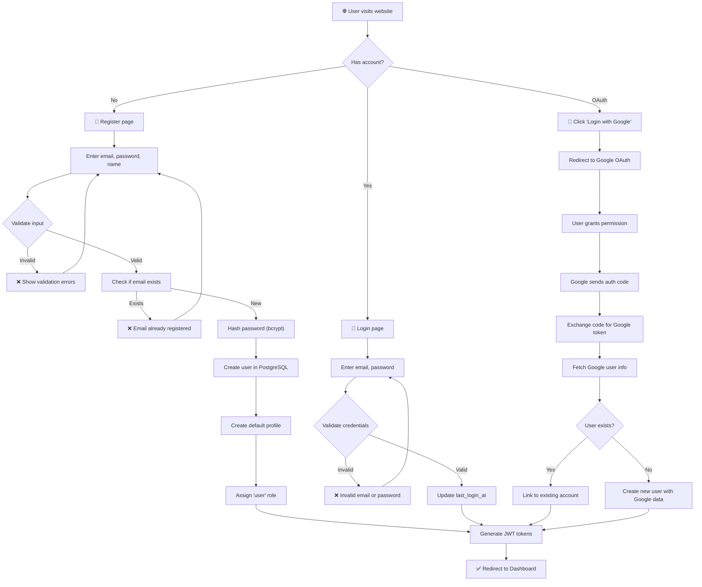

### Login Sequence

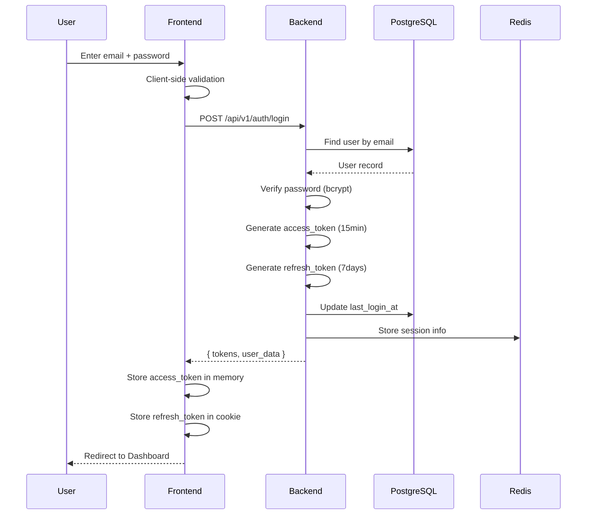

---

## 2. Palm Reading Workflow

> Implemented in Weeks 3-4. Interfaces defined in Week 1.

### Upload & Analysis Flow

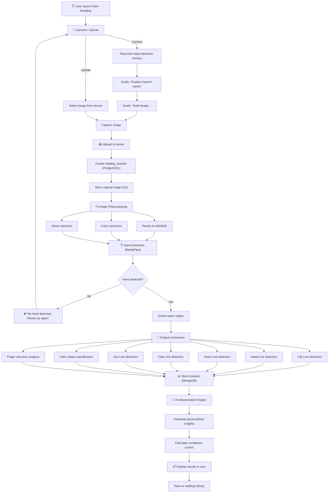

### Palm Feature Extraction Detail

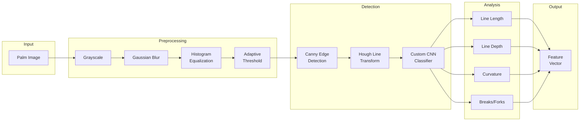

---

## 3. Tarot Reading Workflow

> Implemented in Weeks 3-4. Interfaces defined in Week 1.

### Card Selection Flow

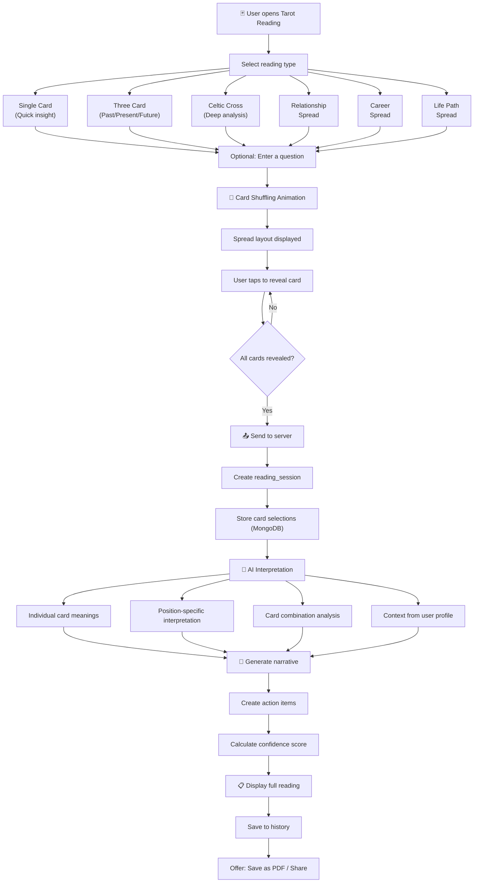

### Tarot Spread Layouts

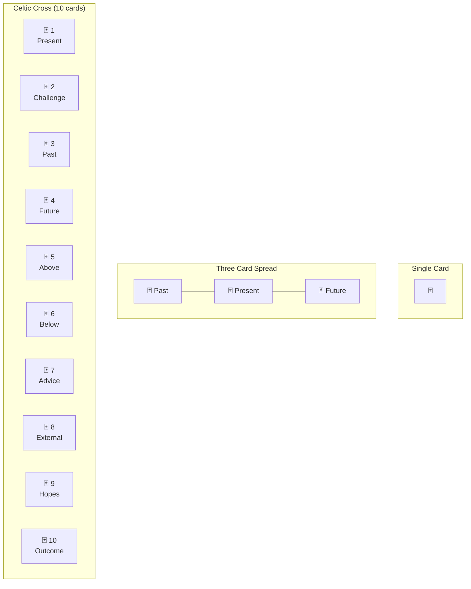

---

## 4. AI Insight Generation Pipeline

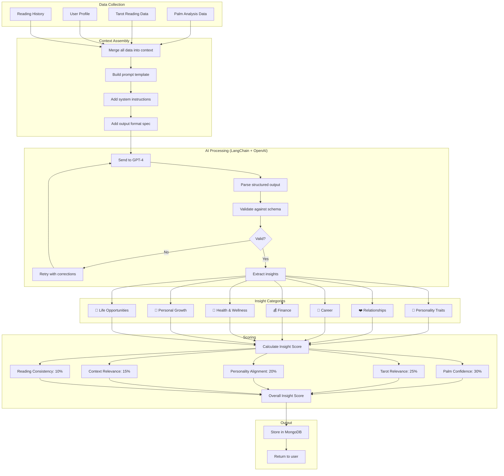

---

## 5. Role-Based Access Flow

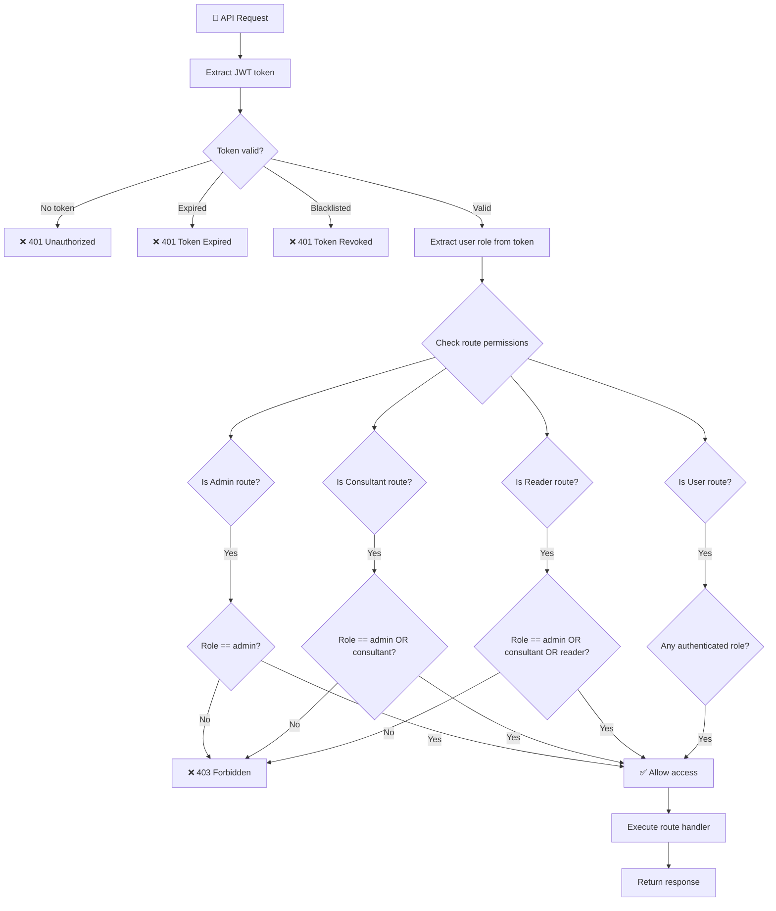

---

## 6. Token Refresh Flow

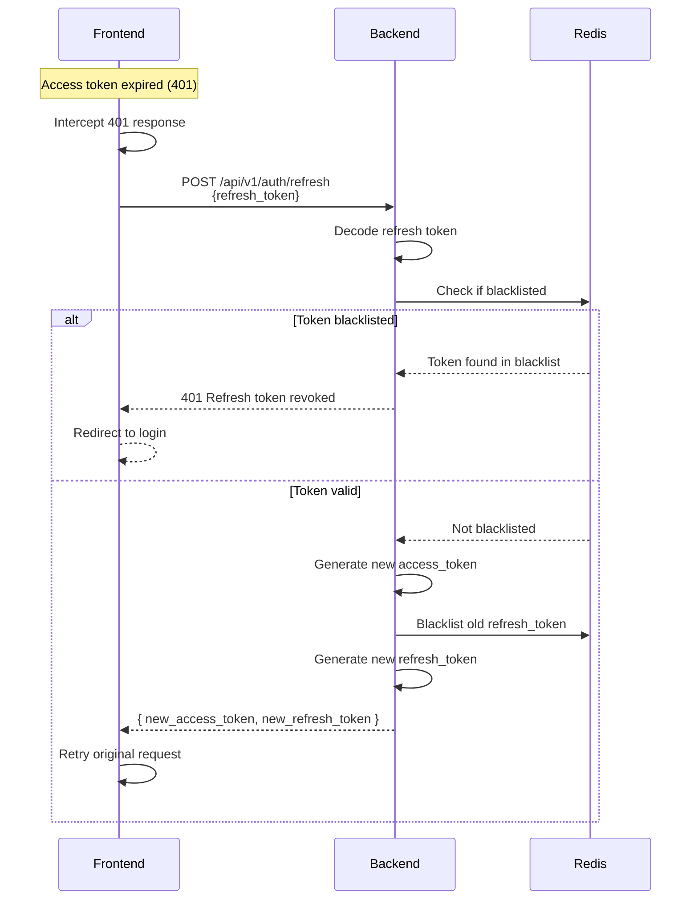

---

## 7. Profile Management Flow

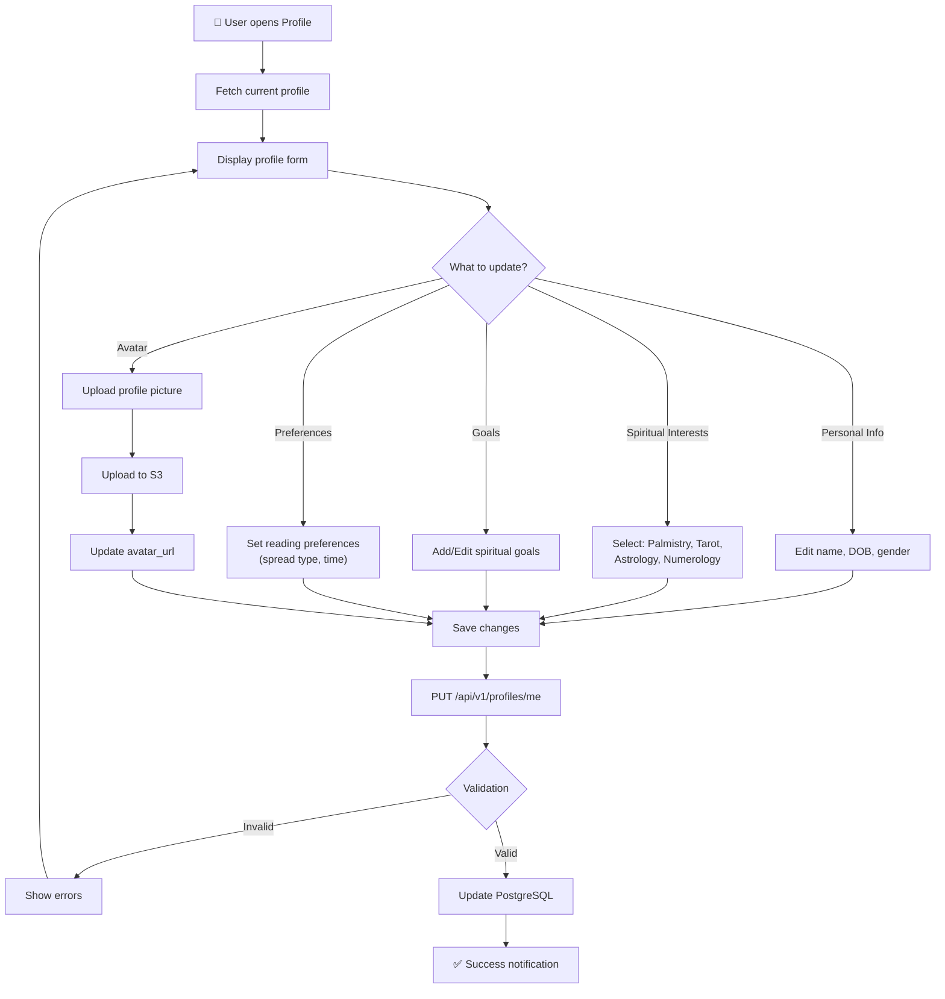

---

## 8. End-to-End User Journey

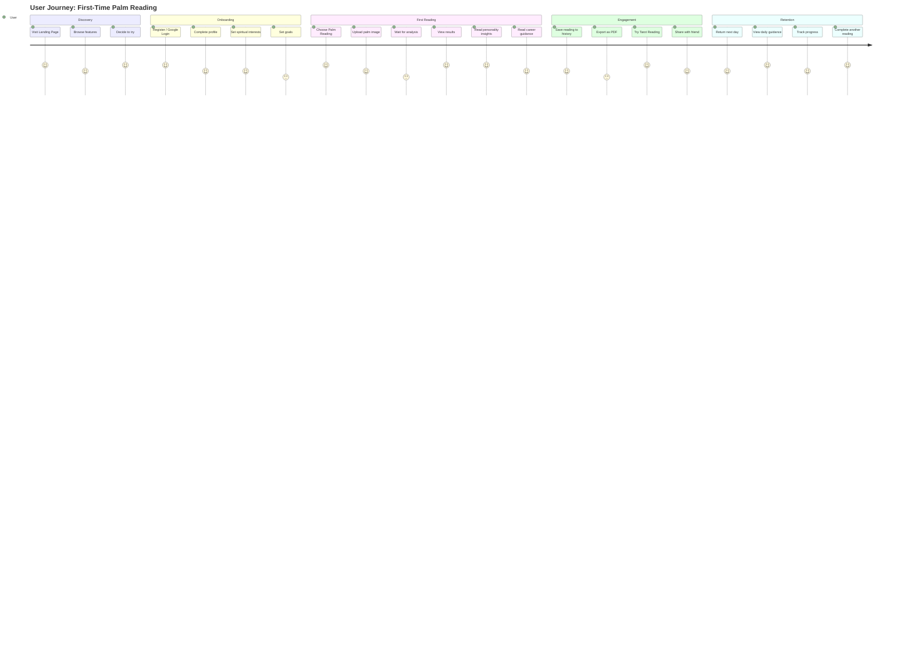

---

## Data Flow Overview

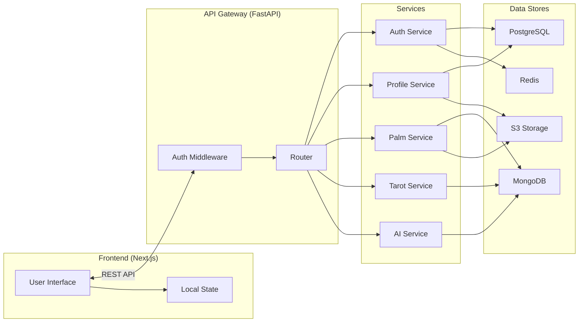
